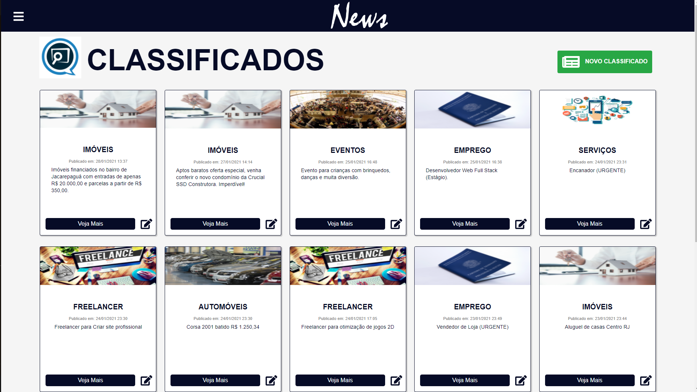
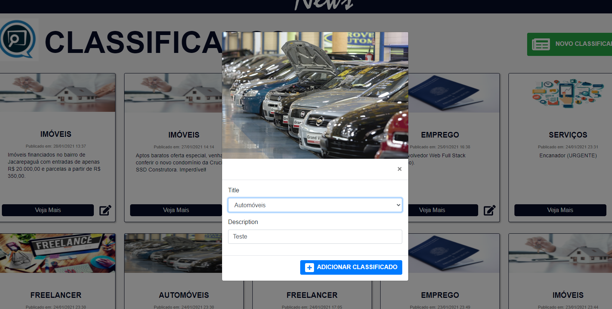

    

Página de classificados do jornal News. Projeto realizado para fins de teste para vaga de estágio em Desenvolvimento Web Full Stack.

## Desafio

Um Jornal Impresso necessita de uma solução moderna para exibir seus classificados na internet. Eles estão em busca de uma aplicação web que exiba os classificados em ordem de cadastro (mais recentes primeiro), contendo o Título, Descrição e Data (Cadastro). A solução deve permitir que qualquer usuário crie um novo classificado. Na criação de um classificado, o Título e a Descrição são obrigatórios e a data deve ser preenchida pelo back-end com a data atual.

## Resultado

### Tecnologias utilizadas

- [JavaScript](https://devdocs.io/javascript/)
- [React](https://pt-br.reactjs.org/docs/getting-started.html)
- [React Icons](https://react-icons.github.io/react-icons/)
- [Hooks](https://pt-br.reactjs.org/docs/hooks-intro.html)
- [Redux](https://redux.js.org/)
- [Styled Components](https://styled-components.com/)
- [.Net Core](https://docs.microsoft.com/pt-br/aspnet/core/introduction-to-aspnet-core?view=aspnetcore-5.0)

### Home Carousel

    

### Menu de navegação Toggle

    

### Home Noticias e propaganda

    

### Página de classificados

    

### Adicionar um classificado

    

### Editar e Deletar um classificado

    

### Rodapé

    

